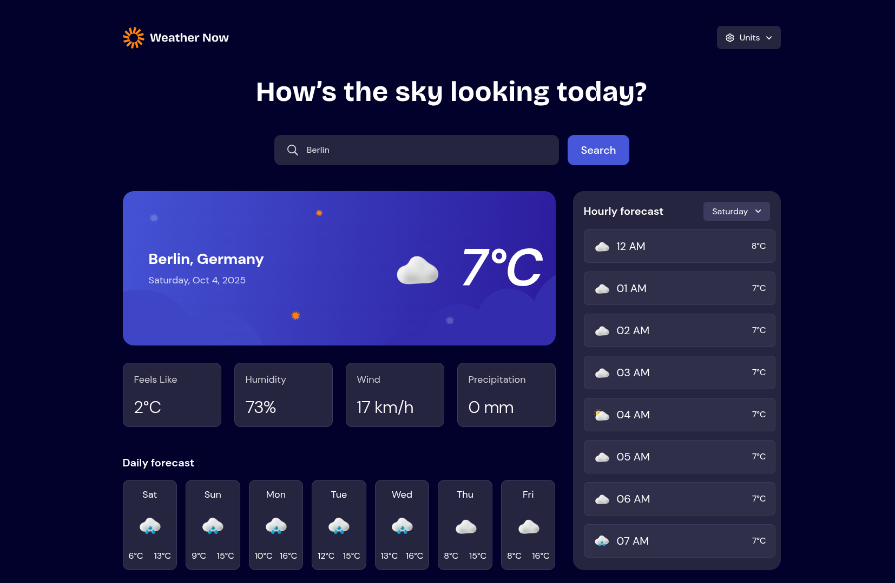
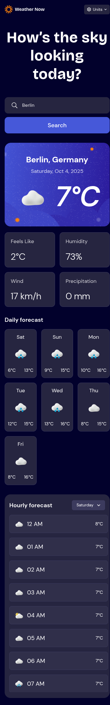

# Frontend Mentor - Weather app solution

This is a solution to the [Weather app challenge on Frontend Mentor](https://www.frontendmentor.io/challenges/weather-app-K1FhddVm49). Frontend Mentor challenges help you improve your coding skills by building realistic projects.

## Table of contents

- [Overview](#overview)
  - [The challenge](#the-challenge)
  - [Screenshot](#screenshot)
  - [Links](#links)
- [My process](#my-process)
  - [Built with](#built-with)
  - [What I learned](#what-i-learned)
- [Author](#author)
- [Acknowledgments](#acknowledgments)

## Overview

### The challenge

Users should be able to:

- Search for weather information by entering a location in the search bar
- View current weather conditions including temperature, weather icon, and location details
- See additional weather metrics like "feels like" temperature, humidity percentage, wind speed, and precipitation amounts
- Browse a 7-day weather forecast with daily high/low temperatures and weather icons
- View an hourly forecast showing temperature changes throughout the day
- Switch between different days of the week using the day selector in the hourly forecast section
- Toggle between Imperial and Metric measurement units via the units dropdown 
- Switch between specific temperature units (Celsius and Fahrenheit) and measurement units for wind speed (km/h and mph) and precipitation (millimeters) via the units dropdown
- View the optimal layout for the interface depending on their device's screen size
- See hover and focus states for all interactive elements on the page

### Screenshot

### Links

- Solution URL: [Frontendmentor solution](https://www.frontendmentor.io/solutions/weather-app-oroE89lK5g)
- Live Site URL: [Live demo](https://starlit-dragon-b065e6.netlify.app/)

## My process

### Built with

- Semantic HTML5 markup
- Tailwind CSS
- Flexbox
- CSS Grid
- Mobile-first workflow
- [Open meteo API](https://open-meteo.com/en/docs) - For weather data
- [Geocoding API](https://open-meteo.com/en/docs/geocoding-api) - For locations
- [Nominatim](https://nominatim.openstreetmap.org) - For getting place name from only coordinates
- [React](https://react.dev/)
- [Headless UI](https://headlessui.com/) - UI Components
- [swr](https://swr.vercel.app/) - For data fetching
- [React Error Boundary](https://www.npmjs.com/package/react-error-boundary) - For handling errors

### What I learned

I learned how to use the browser Geolocation API to request the user's current coordinates, and feed those coordinates into the Nominatim API to display users location name.

## Author

- Frontend Mentor - [@dhiaben20](https://www.frontendmentor.io/profile/dhiaben20)
